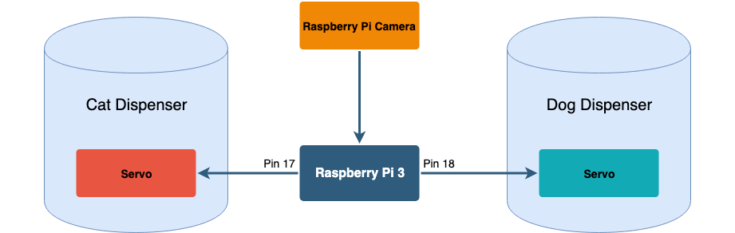

# Auto Feeder for Homeless Animals with Raspberry Pi

This project was part of ECE4180 Final Project at Georgia Institute of Technology. We deployed an object detection model on a Raspberry Pi with a camera to detect animals on the streets and feed them. Our autofeeder will despence food specific to the animal it sees.


## Motivation

There are around 70 million stray animals in the U.S. Nearly 2.7 million dogs and cats homless dogs and cats are killed every year because of no shelter and food. Our project tries to alleviate that by providing food to these homeless animals.  Our autofeeder will despence food specific to the animal it sees. 


## Getting Started

These instructions are all what's needed to get the project up and running.

### Hardware

* Raspberry Pi 3
* Raspberry Pi Camera Module
* 2 Servo Motors


### Installing OpenCV on Raspberry Pi 3

Installing Dependancies:

```
$ sudo apt-get install libhdf5-dev libhdf5-serial-dev libhdf5-100
$ sudo apt-get install libqtgui4 libqtwebkit4 libqt4-test python3-pyqt5
$ sudo apt-get install libatlas-base-dev
$ sudo apt-get install libjasper-dev
```

Installing pip:

```
$ wget https://bootstrap.pypa.io/get-pip.py
$ sudo python3 get-pip.py
```

Installing OpenCV Virtual Enviroment:

```
$ pip3 install virtualenv virtualenvwrapper
# virtualenv and virtualenvwrapper
$ export WORKON_HOME=$HOME/.virtualenvs
$ export VIRTUALENVWRAPPER_PYTHON=/usr/bin/python3
$ source /usr/local/bin/virtualenvwrapper.sh
$ source ~/.profile
$ mkvirtualenv cv -p python3
$ workon cv
$ pip3 install opencv-contrib-python
```

### Other Software Dependancies

```
pip3 install imutils
pip3 install "picamera[array]"
```

### Raspberry Pi Camera

To get the Raspberry Pi camera to work, it first needs to be enabled. In preferences->Raspberry Pi Configuration->Interfaces make sure that Camera is Enabled.


### High Level Schematic




## Using the Application

### Object Detection Model

We are currently using MobileNet SSD model for our object detection. This model is popular because it's one of the quickest models. However, any model could be used instead depending on the user. 


### Running our Application

To run this, we have provide a run.sh

```
$ ./run.sh
```


